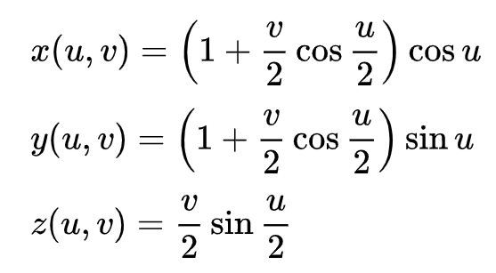
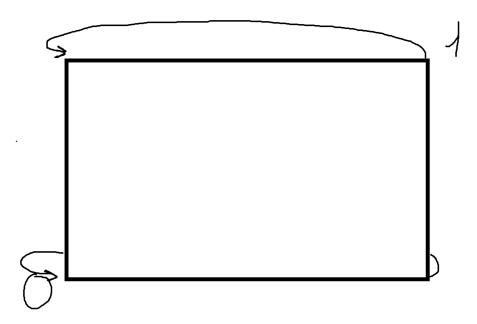
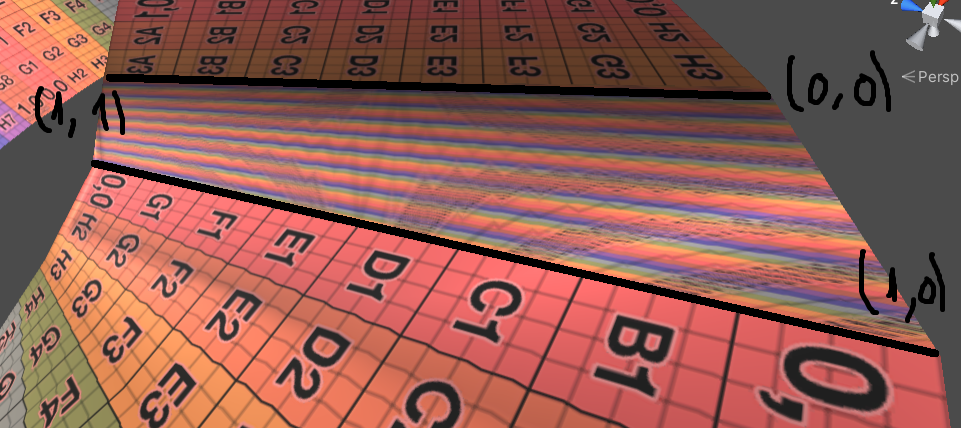
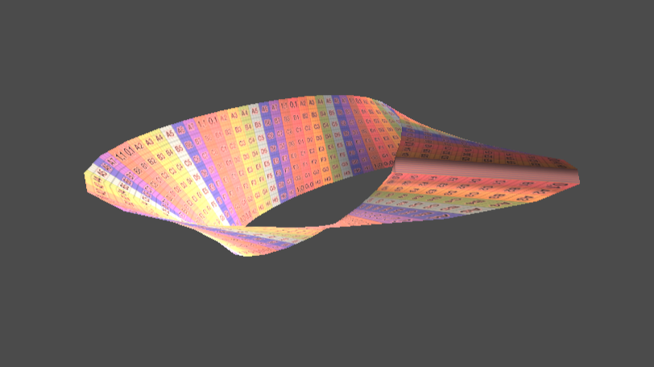

# Mobius strip
A pretty crappy mobius strip implementation thrown together in a couple hours to learn more about parametric surfaces.

    A Mobius Strip is a surface with only one side.

A Mobius Strip in 3 dimensions can be defined as a parametric surface.

Imagine you have a plane going from 

X or  u ∈ [0; 2π[

Y or v ∈ [-1; 1]

We can think of the mobius strip as a transformation of this plane.
So for every point in this plane, there is a series of equations that tell us where this point will actually end up.

## From wikipedia:

In order to render a Mobius Strip, I first created a grid of vertices and triangulated it. Then, I set each vertex's position to the point given by the Mobius Strip equations. So a point P(u, v, 0) would be come P(x(u, v), y(u, v), z(u, v)). The triangles were not changed, meaning that the vertices would retain their original connections. This ends up being just a deformed plane.

## Problem with UV mapping

When UV mapping the grid, it went from (0, 0) in the bottom left corner to (1, 1) in the top right. Howver, the moebius strip loops, meaning that the first edge is connected to the last edge. The problem with this is that the UV coordinates went from 0...1 in a tiny space.

I am sure someone has a way to fix this, but it seems more trouble than its worth.

# Render

